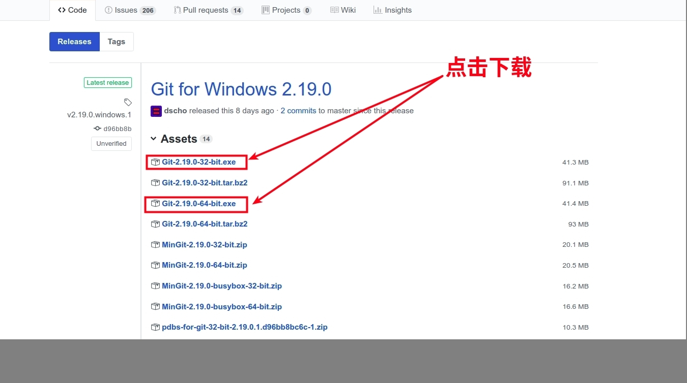
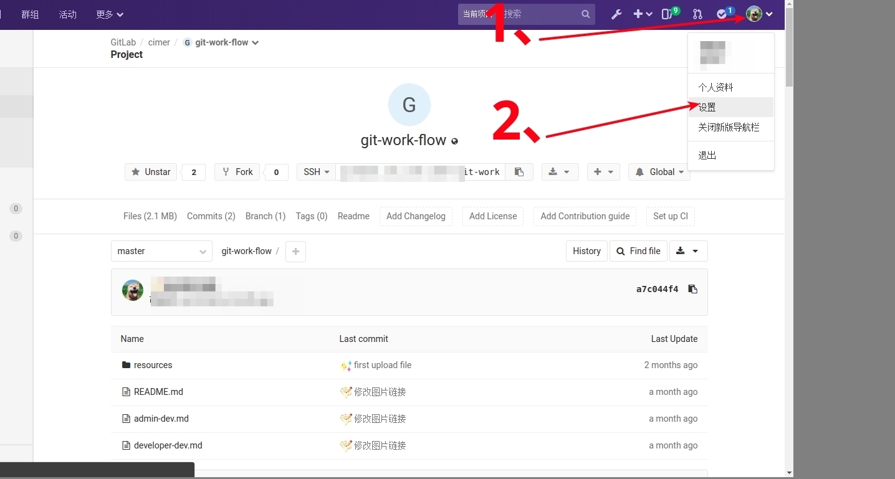
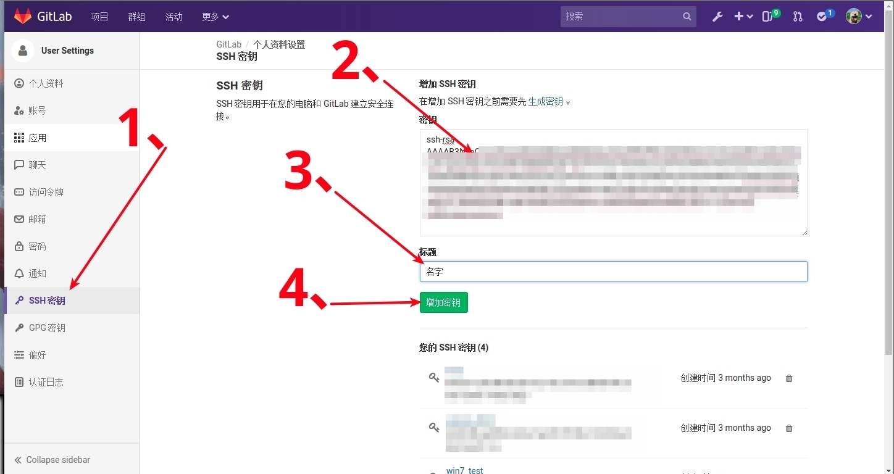
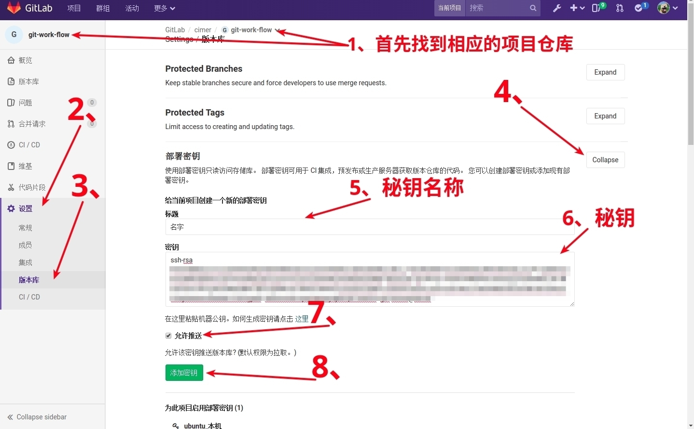
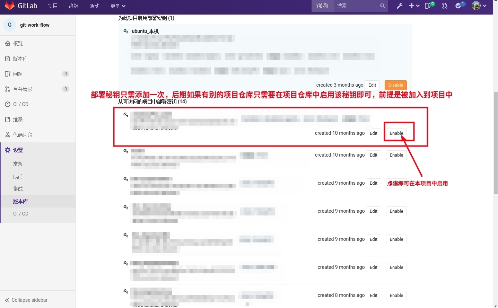
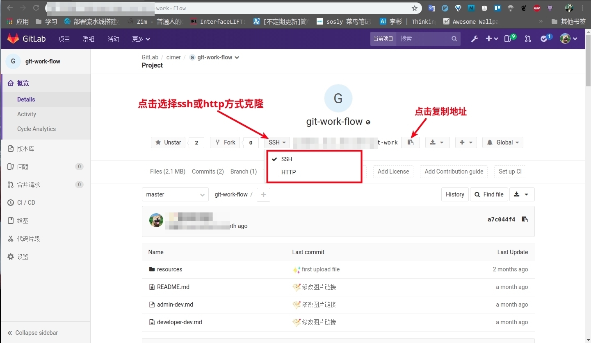

## 使用Git

`Windows`用户需要下载[Git for windows](https://github.com/git-for,-windoiws/git/releases)，下载完成后进行安装。



`$ssh-keygen -t rsa -C "xxxxxxxxxx@qq.com"`

此处只需一直回车, 即可获取公钥 `id_rsa.pub`。`Linux`系统下可在`~/.ssh/`目录下找到`id_rsa.pub`这个文件。`Windows`下则在`C:\Users\cimer\.ssh`目录下找到`id_rsa.pub`文件。

将`id_rsa.pub`里的内容添加到`gitlab`中，然后在本地添加默认用户名和密码





`$git config --global user.name "your Name"`

`$git config --global user.email "email@example.com"`

设置好用户名和密码后，先测试一下是否成功

```bash
$ssh -T git@172.16.2.38
Welcome to GitLab, xxx!
```

登录成功后重复`ssh-keygen -t rsa`的步骤，添加部署秘钥，这里需要注意的是，出现第一个回车的地方，需要改一下生成的文件名，剩下的两个选项都只需要回车即可

```bash
$ssh-keygen -t rsa
Enter file in which to save the key (/c/Users/cimer/.ssh/id_rsa): /c/Users/cimer/.ssh/id_rsa_work // windows 用户
Enter file in which to save the key (/home/cimer/.ssh/id_rsa): /home/cimer/.ssh/id_rsa_work       // *uix、mac 用户
Enter passphrase (empty for no passphrase):
Enter same passphrase again:
Your identification has been saved in /c/Users/cimer/.ssh/id_rsa_work.
Your public key has been saved in /c/Users/cimer/.ssh/id_rsa_work.pub.
The key fingerprint is:
SHA256:YFYGMM590fAGOIzNeBcfDeRq8Y8YZMEhTniAXCODObI cimer@cimer-PC
The key's randomart image is:
+---[RSA 2048]----+
| +oo*X++X*+o     |
|= o=+*O+oB...    |
|.o  oo*o= =      |
|E    o = =       |
|        S .      |
|       . o o     |
|        . . .    |
|                 |
|                 |
+----[SHA256]-----+
```

生成部署秘钥后，和之前同样的步骤，复制`id_rsa_work.pub`文件中的内容，添加到相应的仓库中。





部署秘钥只需要添加一次，以后只需要在项目中启用该秘钥即可。全部操作完成后就可以拉取远程仓库了。

获取远程仓库内容有两种方式。在获取仓库内容前，需要先找好合适的目录存放仓库文件。

### 克隆远程仓库

```bash
$git clone git@172.16.4.112:hufl/HoneyPot_deploy.git
# 或者使用http/https clone
$git clone https://172.16.4.112/hufl/HoneyPot_deploy.git
```

一般gitlab项目中的概览会有具体的克隆地址，直接点击复制即可。




### 连接远程仓库，拉取仓库最新内容

```bash
$git remote set-url --add origin git@172.16.4.112:hufl/HoneyPot_deploy.git
# 或者使用http/https
$git remote set-url --add origin https://172.16.4.112/hufl/HoneyPot_deploy.git
```

添加成功后先拉取仓库的最新内容

```bash
$git pull
```

### 文件上传

```bash
$git add *              // 添加所有文件，*代表所以文件
$git commit -m "update" // 为添加的文件打上 "update" 这个标签，"update" 也可以是其他内容
$git push -u origin dev // 上传本地仓库到远程仓库中的dev分支
```

## 查看Git的全局设置信息

```
$git config -l
```

## 多帐号登录

- 取消git全局设置

```
$git config --global --unset user.name
$git config --global --unset user.email
```

- 针对每个项目，单独设置用户名和邮箱

```
$mkdir test
$cd test
$git init
$git config user.name "your_name"
$git config user.email "your_email"
```

- SSH 配置

```
$cd ~/.ssh
$ssh-keygen -t rsa -C "your_email"
# 设置名称为id_rsa_work
Enter file in which to save the key (/c/User/Administrator/.ssh/id_rsa)：id_rsa_work
# 将id_rsa_work 添加到 SSH agent中
$ssh-add ~/.ssh/id_rsa_work
# 如果出现`Could not open a connection to your authentication agent`的错误，使用以下命令
$ssh-agent bash
$ssh-add ~/.ssh/id_rsa_work
# 创建 config 文件
$touch config
# 配置文件
Host github.com
HostName github.com
# 域名或者IP地址
User git
IdentityFile C:/Users/Administrator/.ssh/id_rsa_work
```

- 权限

```shell
$ sudo chmod 0700 ~/.ssh
$ sudo chmod 0600 ~/.ssh/id_rsa* // 此处包含所有key
```

- 查看`git`提交

```
$ git log --graph --abbrev-commit --decorate --date=relative --format=format:'%C(red)%h%C(r) —— %C(bold blue)%an%C(r): %C(white)%s%C(r) %C(dim white) %C(bold green)(%ar)%C(r) %C(bold yellow)%d%C(r)' --all
```
