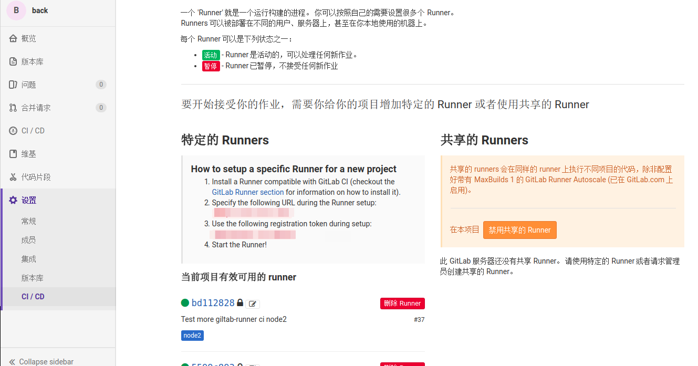
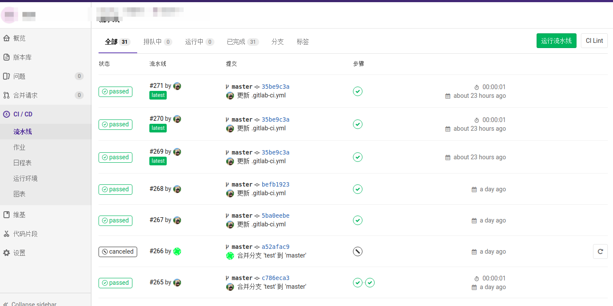
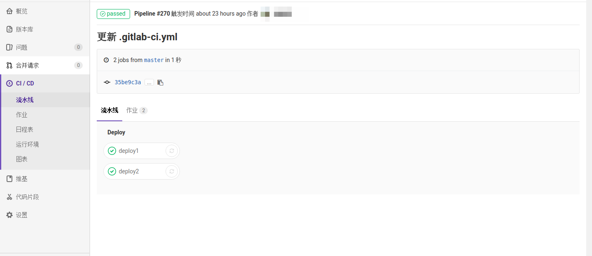
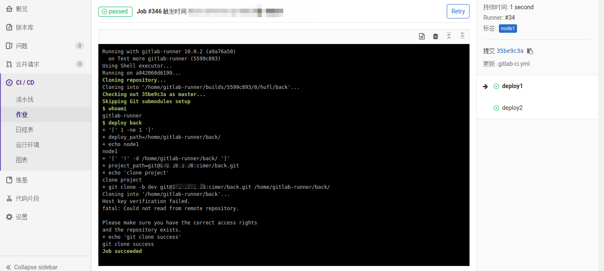

<details>
<summary>点击可展开目录</summary>
<!-- TOC -->

- [介绍](#介绍)
  - [GitLab-Ci](#gitlab-ci)
  - [GitLab-Runner](#gitlab-runner)
    - [特征](#特征)
  - [Pipelines](#pipelines)
- [部署](#部署)

  - [使用容器部署](#使用容器部署)

    - [下载`Runner`镜像](#下载runner镜像)
    - [运行容器](#运行容器)
    - [注册`Runner`](#注册runner)
  - [在Linux系统上直接部署](#在Linux系统上直接部署)
  - [配置构建任务](#配置构建任务)

<!-- TOC -->
</details>

## 介绍

### GitLab-Ci

> `GitLab-Ci`是`GitLab`使用的持续集成系统。

### GitLab-Runner

> `GitLab-Runner`用来配合`GitLab-Ci`实现自动化。`Runner`运行在用代码定义的`.gitlab-ci.yml`中，通过`GitLab-Ci`的`API`来调度任务。</br>
> `Runner`可以是特定于某个项目的，也可以是`GitLab-Ci`中的任何项目。</br>
> `Runner` 就是一个用来执行软件集成脚本的东西。</br>
> `Runner`就像是一个个工人，而`GitLab-CI`就是这些工人的包工头，负责管理这些工人，所有的工人都需要在包工头那边登记注册，并且要告诉包工头自己能为哪个工程服务。如果对应的工程发生了变化，包工头就会通知相应的工人去执行软件集成脚本。

#### 特征

- Allows to run:
  - 多个`Job`同时进行
  - 多个服务器使用多个令牌（甚至每个项目）
  - 限制每个令牌的并发数量
- 可运行的作业:
  - `locally`(本地)
  - 使用`Docker`容器
  - 使用`Docker`容器并通过`SSH`执行作业
  - 在不同的云或虚拟化管理程序上使用`Docker`容器进行自动缩放
  - 连接到远程`SSH`服务器
- 在`GO`中编写，并且以单个二进制文件的形式分发，没有其他要求
- 支持`Bash`,`Windows Batch`和`PowerShell`
- 适用于`GNU/Linux`,`OS X`和`Windows`（几乎在任何地方都可以运行`Docker`）
- 允许自定义作业运行环境
- 自动配置重新加载无需重启
- 支持`Docker`,`Docker-SSH`,`Parallels`和`SSH`运行环境的易于使用的设置
- 启用`Docker`容器的缓存
- 易于安装作为`GNU/Linux`,`OS X`和`Windows`的服务
- 嵌入`Prometheus`指标`HTTP`服务器

### Pipelines

> `Pipeline`是定义`.gitlab-ci.yml`中的不同阶段的不同任务。是一组阶段（批次）执行的作业。并行执行一个阶段中的所有作业（如果有足够的并发运行程序），并且如果它们全部成功，则管道移动到下一阶段。如果其中一个作业失败，下一极端不（通常）执行。您可以访问项目的`Pipelines`选项卡中的`Pipelines`页面

## 部署

### 使用容器部署

#### 下载`Runner`镜像

```bash
$ sudo docker pull gitlab/gitlab-runner:latest
```
#### 运行容器

```bash
$ sudo docker run -d --name gitlab-runner --restart always \
  -v /srv/gitlab-runner/config:/etc/gitlab-runner \
  -v /var/run/docker.sock:/var/run/docker.sock \
  gitlab/gitlab-runner:latest
```

#### 注册`Runner`

1. 运行以下命令：

```bash
$ sudo docker exec -it gitlab-runner gitlab-runner register
```

2. 输入你的`Gitlab`实例的`URL`：

```bash
Please enter the gitlab-ci coordinator URL (e.g. https://gitlab.com )
https://gitlab.com
```

3. 输入你获得的注册`Runner`的令牌：

```bash
Please enter the gitlab-ci token for this runner
oP-sU5riDmsT462a44kK
```

4. 输入`Runner`的描述，稍后可以在`Gitlab`的用户界面中进行更改：

```bash
Please enter the gitlab-ci description for this runner
[hostame] my-runner
```

5. 输入与`Runner`关联的标签，稍后可以在`Gitlab`的用户界面中进行更改：

```bash
Please enter the gitlab-ci tags for this runner (comma separated):
my-tag
```

6. 选择`Runner`是否应该选择没有标签的作业，可以稍后在`Gitlab`的用户界面更改（默认为`false`）：

```bash
Whether to run untagged jobs [true/false]:
[false]: true
```

7. 选择是否将`Runner`锁定到当前项目，收货可以在`Gitlab`的用户界面进行更改。`Runner`特定时有用（默认为true）：

```bash
Whether to lock Runner to current project [true/false]:
[true]: true
```

8. 选择`Runner`执行程序：

```bash
Please enter the executor: ssh, docker+machine, docker-ssh+machine, kubernetes, docker, parallels, virtualbox, docker-ssh, shell:
docker
```

9. 如果你选择`Docker`作为你的执行程序，则会要求你为默认镜像用于未在`.gitlab-ci.yml`定义其中的项目：

```bash
Please enter the Docker image (eg. ruby:2.1):
alpine:latest
```

注册好的`Runner`配置文件存放位置：

```bash
/etc/gitlab-runner/config.toml
```

### 在Linux系统上直接部署

```bash
$ curl -L https://packages.gitlab.com/install/repositories/runner/gitlab-runner/script.deb.sh | sudo bash
$ sudo apt install gitlab-runner
$ gitlab-runner register
// 注册runner
// 需要注册两个runner，前端和后端各一个
$ mkdir -p /home/lilei/.gitlab-runner
$ touch /home/lilei/.gitlab-runner/config.toml
$ sudo gitlab-runner install -n "test" -d "/home/lilei" -c "/home/lilei/.gitlab-runner/config.toml" -u "cimer"
// -n 指定服务名称， -d 指定工作路径， -c 指定配置文件, -u 指定执行用户
$ sudo gitlab-runner start -n test
```



### 配置构建任务

在项目的根目录添加`.gitlab-ci.yml`文件

```yaml
stages:
- deploy

deploy1:
  stage: deploy
  script:
    - whoami
    - echo node1
  only:
    - master
  tags:
    - node1


deploy2:
  stage: deploy
  script:
    - whoami
    - echo node2
  only:
    - master
  tags:
    - node2
```








