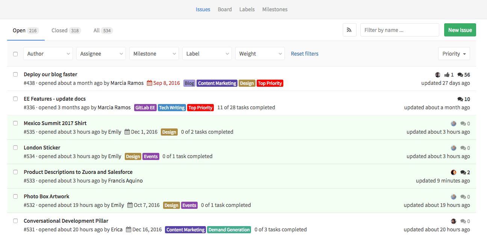
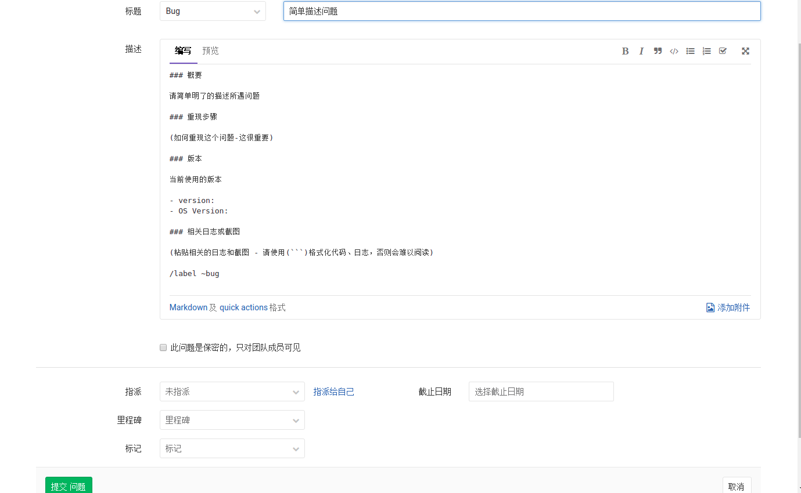
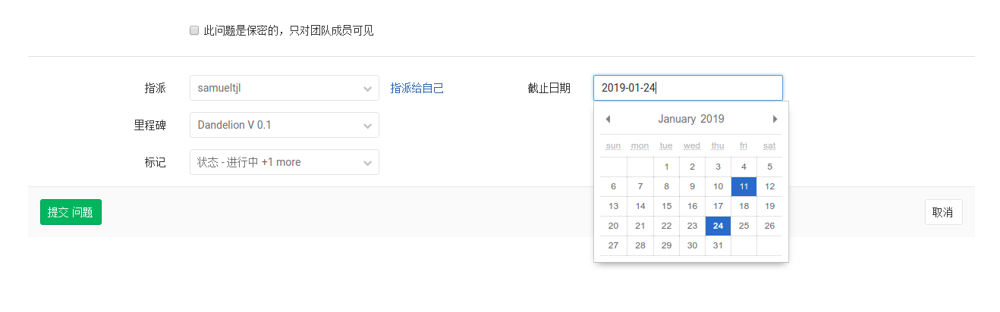

## 工单追踪

`Gitlab`有一个强大的工单追溯系统，在使用的过程中，允许你和你的团队分享和讨论建议。

每一个在`Gitlab`上部署的项目都有一个工单追踪器，即`Issue`。找到你的项目中的`Issues`->`New issue`来创建一个新的工单。建立一个标题来总结要被讨论的主题，并且使用`Markdown`来描述它。

而每个`issue`都可以指派到个人，添加标记，设置工时，加入到开发里程碑中，也可设置保密性。

- 保密`issue`

  无论何时，如果你仅仅想要在团队中讨论这个`issue`，都可以将此`issue`设置为只对团队成员可见。即使你的项目是公开的，你的`issue`也会被保密起来。只要不是本项目的成员，想要访问该`issue`地址时，浏览器皆会返回404错误。

- 截止日期

  每个`issue`都允许你教填写一个截止日期，有些团队工作时间表安排紧凑，以某种方式去设置一个截止日期来解决问题，是有必要的。这些都可以通过截止日期这一功能实现，截止时期也可以用作工时安排。

  当你对一个多任务项目有截止日期的时候----比如说，一个新的发布活动、项目的启动，或者按阶段追踪任务----你可以使用里程碑。

- 指派

  要让某个人处理某个`issue`，可以将其分配给他。你可以任意修改被分配者，直到萍踪人的需求。这个功能 的想法是，一个受托者本身对这个`issue`负责，直到其将这个工单重新赋予他人。

  这也可以 用于按受托者筛选工单。

- 标签

  标签此工作流的一个重要组成部分。你可以使用它们来分类你的`issue`，在工作流定位，以及通过优先级标签来安排其优先级顺序。

  标签使得你与[Issue看板](工作流程#Issue看板)协同工作，加快项目进度以及开展你的工作流。

### 工单规范

- [BUG模板](需求和BUG模板/BUG.md)
- [需求模板](需求和BUG模板/FEATURE.md)
- [回复BUG模板](需求和BUG模板/REPLY_BUG.md)
- [回复需求模板](需求和BUG模板/REPLY_FEATURE.md)

## Issue看板

在项目中，Issue看板是一个用于计划以及组织你的`issue`，使之符合你的项目工作流的工具。

看板包含了与其相关的相应标签，每一个列表包含了相关的被标记的工单，并且以卡片的形式展示出来。

这些卡片可以在列表之间移动，被移动的卡片，其标签将会依据你移动的位置相应更新到列表上。

[看板方法]()是一个非常好的工作方法，值得花费一些时间去好好学习。

