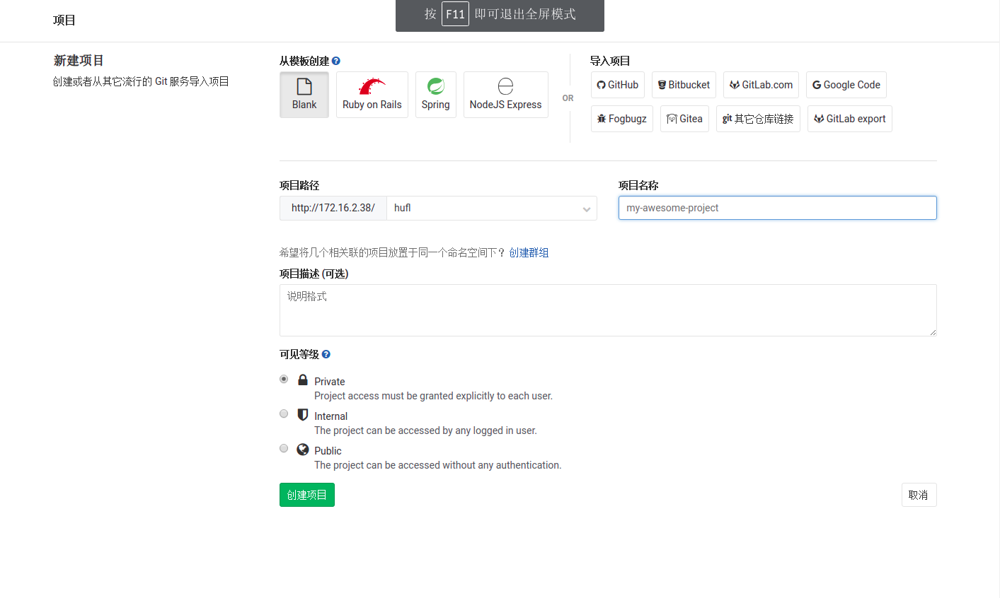

## 管理员

1. 创建项目

2. 初次提交

   > 1. git clone http://xxxxx.com/test/test.git #克隆仓库到本地
   > 2. cd test #进入仓库
   > 3. touch xxx.md #创建新文件或添加项目
   > 4. git add xxx.md
   > 5. git commit -m "init commit"
   > 6. git push origin master #推送初始化提交

3. 设置默认分支`dev`

   

    