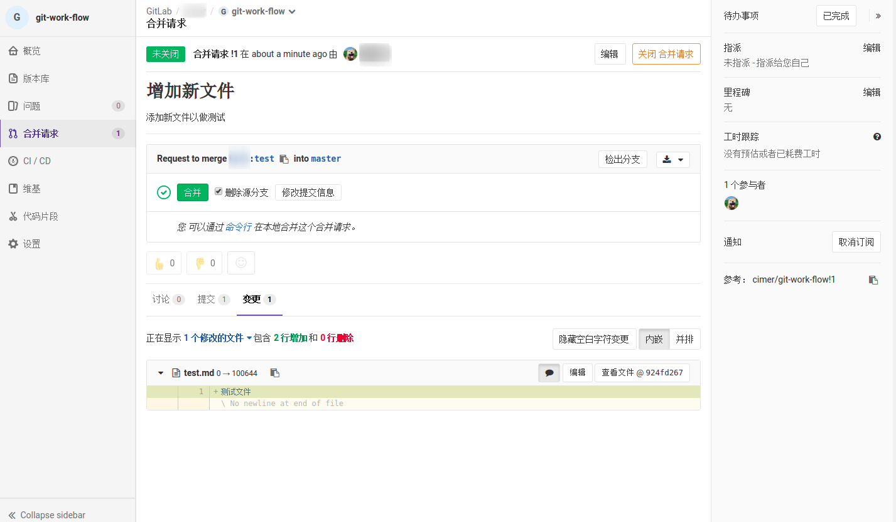

- 例如主仓库地址为：`http://gitlab.com/admin/project.git`

- 开发者（如tom）`fork`该项目到自己的仓库

  

  

  

- 开发者将`fork`的项目`clone`到本地

  ```shell
  git clone git@gitlab.com/tom/project.git
  ```

- 添加主仓库为上游仓库

  ```shell
  git remote add upstream http://gitlab.com/admin/project.git
  ```

- 获取上游分支最新提交并合并到自己仓库的开发分支上

  ```shell
  git fetch upstream dev
  git merge upstream/dev dev
  git push origin dev
  ```

- 从自己仓库的`dev`分支创建功能/BUG分支（分支名以[feature/bug]-[issue-id]为名）

  ```shell
  git checkout dev
  git checkout -b feature/bug-xx
  ```

- 在该分支下进行开发，开发完成后，提交到`gitlab`上

  ```shell
  git add *
  git commit -m "xxxxxx" # 或者使用 git_commit工具
  git push origin feature/bug-xx
  ```

- 当分支提交成功后，打开`gitlab`前端，从前端发起`Merge Request`

  

  *注：来源分支为自己仓库的`功能/BUG`分支，目标分支一般为`dev`分支*

  

  *注：此处和`issue`一样，可填写描述信息，指派人员，选择里程碑，选择标记，选择合并后删除源分支*

  

  *注：可选择提交查看有多少次提交，也可在变更处查看具体变更内容*

  

- 提交完成后，等待管理员进行代码审查，具体审查内容可在`变更`中查看。若代码没问题，则由管理员进行合并，若有问题则修改后重新审查，直到代码审查成功。此处也可以由团队成员交叉审查，审查成功后通知管理员，由管理员进行合并。

***注意：在开发过程中，我们任何时候都可以从主仓库获取最新的代码，合并到我们的当前开发分支上。而每次开发前都必须拉取最新的代码，并合并到当前开发分支上，最后提交的步骤是和上面一样的。***

- 若当前正在`功能/bug`分支上

  ```shell
  git fetch upstream dev
  git merge upstream/dev dev
  git merge upstream/dev feature/bug-xx
  # 继续开发
  ```

  

- 若当前还未开始开发`功能/bug`分支

```shell
git fetch upstream dev
git merge upstream/dev dev
git chekcout dev
git push origin dev
git checkout -b feature/bug-xx
# 开始开发
```

